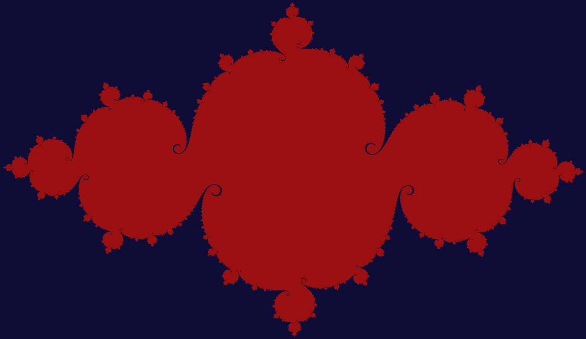

# Eigenwards

Okay, let's just get this out of the way before anything else:

* "Eigen" refers to eigenvalues, eigenvectors, eigenstuff;

* "-wards" is a direction suffix found in words such as "northwards", "skywards", "inwards".

Together, they form "Eigenwards", which means seeking a natural, intrinsic direction in your life or some cheesy crap like that.
It does NOT refer to Hogwarts School of Witchcraft and Wizardry and this website has no affiliation with that institution.

